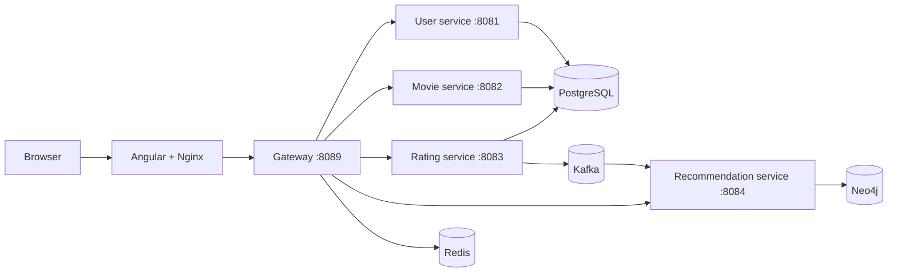
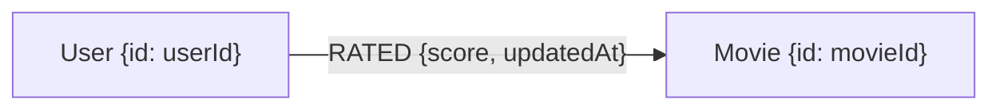

# Neo4flix

Neo4flix is a movie-catalog and recommendation application built as a set of Spring Boot services with an Angular frontend. PostgreSQL stores account, catalog, and rating records; Kafka carries rating events; Neo4j builds a graph used by the recommendation service; Redis supports gateway and service caching/rate-limiting behavior.

## Contents

- [Architecture](#architecture)
- [Run locally with Docker Compose](#run-locally-with-docker-compose)
- [Neo4j recommendation graph](#neo4j-recommendation-graph)
- [HTTP API](#http-api)
- [Development and tests](#development-and-tests)
- [Known limitations](#known-limitations)

## Architecture



| Component | Responsibility | Local port |
| --- | --- | ---: |
| Frontend | Angular single-page application served by Nginx | `8080` (redirects to HTTPS), `8443` |
| Gateway | Routes `/api/v1/**`, validates JWTs, and forwards user identity headers | `8089` |
| User service | Registration, MFA, profile, watchlist, and sharing | `8081` inside Compose |
| Movie service | Catalog listing, pagination, search, and batch lookup | `8082` inside Compose |
| Rating service | Creates/updates ratings and publishes rating events | `8083` inside Compose |
| Recommendation service | Consumes rating events and queries the Neo4j graph | `8084` inside Compose |
| PostgreSQL | Relational data for user, movie, and rating services | `5432` |
| Redis | Gateway/service cache and token/rate-limit support | `6379` |
| Kafka | `movie-ratings-topic` event transport | `9092` on host; `29092` between containers |
| Neo4j | User/movie rating graph | `7474` Browser, `7687` Bolt |

The backend modules each have their own Maven wrapper and Dockerfile. The frontend uses Angular 19 and is built into the Nginx image.

## Run locally with Docker Compose

### Prerequisites

- Docker Engine with the Docker Compose plugin
- A local `.env` file containing the Compose settings
- Frontend TLS certificate files at `front-end/certs/neo4flix.pem` and `front-end/certs/neo4flix-key.pem`

The `.env.example` file intentionally contains fake values, including reserved `example.invalid` hosts. Copy it only as a template, then replace the fake values with local development settings. Keep `.env` private; it is ignored by Git. Use strong, unique credentials outside local development.

```bash
cp .env.example .env
```

For the Compose network, service connection values should use the Compose DNS names: `postgres`, `redis`, `neo4j`, and `kafka-service`. The gateway URLs should point to `user-service:8081`, `movie-service:8082`, `rating-service:8083`, and `recommendation-service:8084`. Database URLs use the `postgres` hostname and their matching databases: `user_db`, `movie_db`, and `rating_db`.

The frontend image requires the two TLS files at build time. See [https.setup.md](https.setup.md) for generating locally trusted certificates and configuring `neo4flix.local`.

### Start the stack

```bash
docker compose up --build -d
docker compose ps
```

Open `https://neo4flix.local:8443` after following the hostname and certificate setup in [https.setup.md](https.setup.md). Nginx redirects HTTP to HTTPS and proxies `/api/` to the gateway. The gateway is also published at `http://localhost:8089` for direct API testing. Neo4j Browser is available at `http://localhost:7474`; authenticate with the Neo4j username and password from `.env`.

Useful operations:

```bash
docker compose logs -f gateway recommendation-service rating-service
docker compose logs -f neo4j kafka-service
docker compose down
```

PostgreSQL creates `user_db`, `movie_db`, and `rating_db` from `docker/postgres/init-databases.sql` only when the PostgreSQL data directory is initialized for the first time. If you change database initialization settings after the data volume has been created, create the databases manually. `docker compose down -v` deletes the PostgreSQL volume and its data; do not use it unless you intend to reset that data. Neo4j currently has no named data volume in Compose, so removing its container may discard the graph.

## Neo4j recommendation graph

Neo4j is populated asynchronously from rating events. It does not currently contain movie titles, genres, artwork, or other catalog metadata; the graph stores IDs and rating relationships only.

### Graph shape



- `User.id` is the user identifier from the rating event, stored as a string.
- `Movie.id` is the catalog movie identifier, stored as a number.
- `RATED.score` is the submitted integer rating, validated by the Rating API to be between 1 and 5.
- `RATED.updatedAt` is a Unix timestamp in milliseconds set when the graph edge is processed.

### Event-to-graph flow

1. The Rating service saves a rating in PostgreSQL. A later submission for the same user and movie updates that rating.
2. The service publishes `MovieRatedEvent(userId, movieId, score)` to Kafka topic `movie-ratings-topic`.
3. The Recommendation service consumes the event using group `recommendation-service-group`.
4. The consumer runs this parameterized Cypher query:

```cypher
MERGE (u:User {id: $userId})
MERGE (m:Movie {id: $movieId})
MERGE (u)-[r:RATED]->(m)
SET r.score = $score, r.updatedAt = timestamp()
```

`MERGE` reuses matching nodes and the matching relationship, so a new rating event updates the edge instead of intentionally creating another edge for that same user/movie pair. The graph is built only as events arrive; existing PostgreSQL ratings are not backfilled automatically. It can therefore be empty until new ratings are submitted and consumed.

### Recommendation rule

`GET /api/v1/recommendations` applies a simple user-to-user collaborative-filtering rule:

1. Find movies the requested user rated `4` or `5`.
2. Find other users who also rated those movies `4` or `5`.
3. Collect other high-rated movies from those users that the requested user has not rated.
4. Count matching paths per candidate movie, sort by that count descending, and return at most 10 results.

Each result contains `movieId` and `relevanceScore`. This is a co-rating count, not a normalized prediction or a machine-learned score. Results need a separate lookup in the Movie service to display movie metadata.

### Inspect the graph in Neo4j Browser

Connect to `http://localhost:7474` with the Neo4j credentials from `.env`, then run:

```cypher
// Visualize up to 100 user-to-movie rating edges.
MATCH p=(u:User)-[:RATED]->(m:Movie)
RETURN p
LIMIT 100;
```

```cypher
// Inspect individual ratings and their processing timestamps.
MATCH (u:User)-[r:RATED]->(m:Movie)
RETURN u.id AS userId, m.id AS movieId, r.score AS score, r.updatedAt AS updatedAt
ORDER BY updatedAt DESC
LIMIT 50;
```

```cypher
// Count graph nodes and rating edges.
MATCH (u:User)
WITH count(u) AS users
MATCH (m:Movie)
WITH users, count(m) AS movies
MATCH ()-[r:RATED]->()
RETURN users, movies, count(r) AS ratings;
```

The current application does not create uniqueness constraints. For production use, first check for duplicate IDs, then consider adding constraints for `User.id` and `Movie.id` so concurrent event processing cannot create duplicate logical nodes.

## HTTP API

All routes below are mounted under `/api/v1` and are routed through the gateway on port `8089`. Except for the gateway's configured public routes, send `Authorization: Bearer <token>`. The gateway validates the JWT and forwards its user identity as `X-User-Id`; do not choose this header from client-supplied identity data.

| Method | Path | Purpose |
| --- | --- | --- |
| `POST` | `/auth/register` | Register an account |
| `POST` | `/auth/mfa/verify` | Verify MFA setup |
| `POST` | `/auth/login` | Authenticate and obtain a token |
| `GET`, `PUT` | `/users/profile` | Read or update the profile |
| `GET` | `/users/watchlist` | List the current user's movie IDs |
| `POST`, `DELETE` | `/users/watchlist/{movieId}` | Add or remove a movie |
| `GET` | `/users/watchlist/check/{movieId}` | Check watchlist membership |
| `GET` | `/movies` | List movies |
| `GET` | `/movies/paginated?page=0&size=8` | List a page of movies |
| `GET` | `/movies/{movieId}` | Fetch one movie |
| `GET` | `/movies/search?query=...&genre=...&releaseYear=...&page=0&size=8` | Search/filter movies |
| `POST` | `/movies/batch` | Fetch cards for a list of movie IDs |
| `POST` | `/ratings` | Create or update a rating and publish its event |
| `GET` | `/ratings/movie/{movieId}` | List ratings for a movie |
| `GET` | `/ratings/movie/{movieId}/summary` | Get one movie's rating summary |
| `GET` | `/ratings/summaries?movieIds=1,2` | Get summaries for multiple movies |
| `GET` | `/recommendations` | Get recommendations for the authenticated user |
| `POST` | `/shares` | Share a movie/recommendation |
| `GET` | `/shares/received` | List received shares |

Rating requests use a 1-to-5 score and a movie ID:

```json
{
  "movieId": 42,
  "score": 5
}
```

## Development and tests

Run backend tests with the wrapper in each module:

```bash
cd user && ./mvnw test
cd ../movie && ./mvnw test
cd ../rating && ./mvnw test
cd ../recommendation && ./mvnw test
cd ../gateway && ./mvnw test
```

Run frontend checks from `front-end/`:

```bash
npm ci
npm test
npm run build
```

For backend development outside Compose, provide service-specific Spring environment variables such as `SPRING_DATASOURCE_URL`, `SPRING_DATASOURCE_USERNAME`, and `SPRING_DATASOURCE_PASSWORD`; the checked-in YAML fallback values are deliberately fake and will not connect to real services. The development frontend API base URL is `http://localhost:8089/api/v1`; the production build uses same-origin `/api/v1` and relies on Nginx's gateway proxy.

## Known limitations

- Recommendations are not yet loaded into the Angular UI; the current UI still has sample recommendation content.
- The recommendation API returns graph movie IDs and co-rating counts, not hydrated catalog cards or genre/date-filtered results.
- Existing ratings are not replayed into Neo4j when the stack starts; events must be produced after the consumer is running.
- The gateway's public movie path and the Movie controller's implemented paths should be aligned before relying on unauthenticated catalog access.
- The gateway currently logs user identity details, and the registration handler logs request data. Review and redact these logs before production use.
- Compose is a local development topology. Configure TLS trust, persistent Neo4j storage, strong secrets, service health/readiness, and production access controls before deployment.

For local HTTPS certificate generation and browser trust setup, see [https.setup.md](https.setup.md).